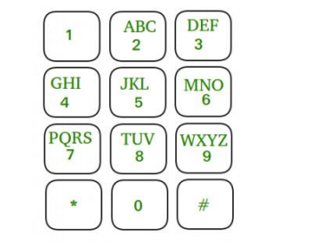
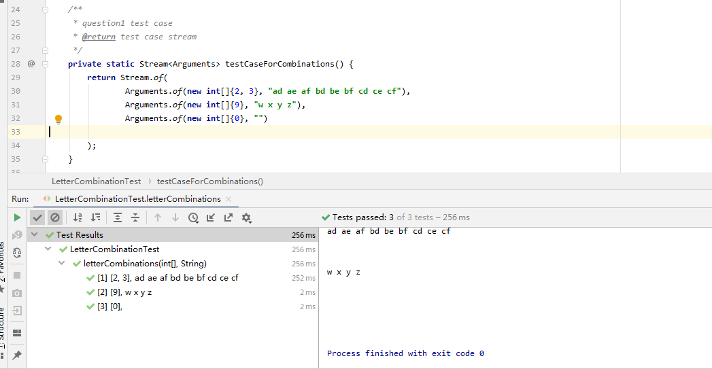
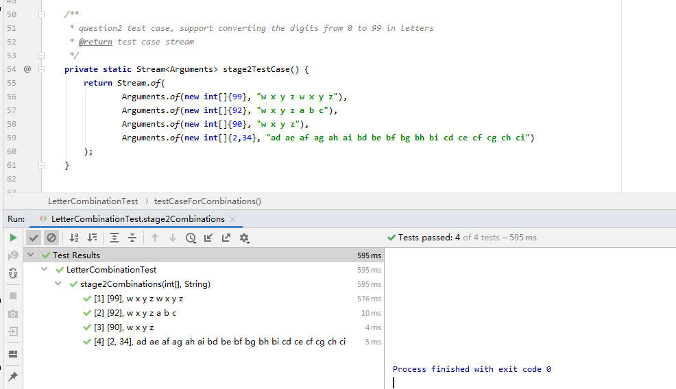

# MiniCodeTest

#Problem Description
Given an integer array containing digits from [0, 9], the task is to print all possible letter
combinations that the numbers could represent. A mapping of digit to letters (just like
on the telephone buttons) is being followed. Note that 0 and 1 do not map to any
letters. All the mapping are shown in the image below:

Write a program to convert the digits from 0 to 9 into letters
Example:
Input: arr[] = {2, 3}
Output: ad ae af bd be bf cd ce cf
Input: arr[] = {9}
Output: w x y z

#Stage 2 - new requirements
The program need to support converting the digits from 0 to 99 into letters

#### #solution (Unit Test)

Stage 1

Stage 2

